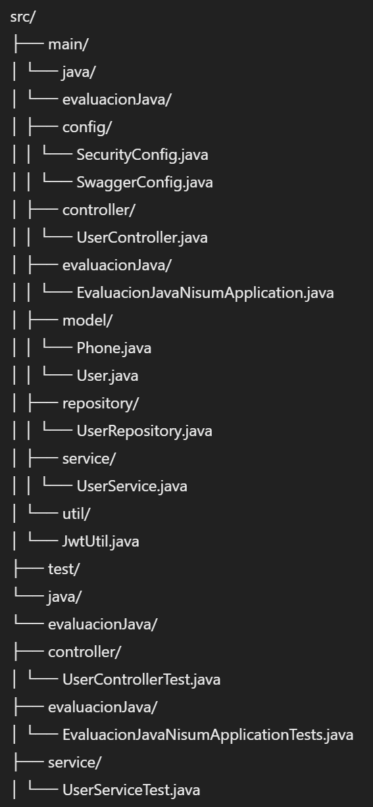

# Evaluación Java Nisum

Este proyecto es una aplicación Java de ejemplo que implementa la gestión de usuarios utilizando Spring Boot, Spring Data JPA, Spring Security, y JWT para la autenticación. También incluye la documentación de la API utilizando Swagger.

## Tabla de Contenidos

1. [Descripción](#descripción)
2. [Tecnologías Utilizadas](#tecnologías-utilizadas)
3. [Estructura del Proyecto](#estructura-del-proyecto)
4. [Instalación](#instalación)
5. [Ejecución de la Aplicación](#ejecución-de-la-aplicación)
6. [Uso de la API](#uso-de-la-api)
7. [Pruebas](#pruebas)
8. [Swagger](#swagger)
9. [Autor](#autor)

## Descripción

La aplicación permite registrar y autenticar usuarios. Los usuarios pueden iniciar sesión y recibir un token JWT que se utilizará para autenticar solicitudes posteriores.

## Tecnologías Utilizadas

- Java
- Spring Boot
- Spring Data JPA
- Spring Security
- JWT (JSON Web Token)
- Mockito
- JUnit
- Swagger

## Estructura del Proyecto




## Instalación

1. Clonar el repositorio:
   ```bash
   git clone https://github.com/tu-usuario/evaluacion-java-nisum.git
   cd evaluacion-java-nisum
   
2. Construir el proyecto con Maven:
   ```bash
   mvn clean install

## Ejecución de la Aplicación

1. Ejecutar la aplicación:
   ```bash
   mvn spring-boot:run
   
2. La aplicación estará disponible en http://localhost:8080.

## Uso de la API

### Registro de Usuario

- **URL:** `/users`
- **Método:** `POST`
- **Cuerpo de la Solicitud:**
  ```json
  {
      "name": "Juan Rodriguez",
      "email": "juan@rodriguez.org",
      "password": "hunter2",
      "phones": [
          {
              "number": "1234567",
              "citycode": "1",
              "countrycode": "57"
          }
      ]
  }

- **Respuesta Exitosa:**

  ```json
  {
    "id": "uuid",
    "created": "2023-06-01T12:00:00",
    "modified": "2023-06-01T12:00:00",
    "lastLogin": "2023-06-01T12:00:00",
    "token": "jwt-token",
    "isActive": true
  }

### Inicio de Sesión

- **URL:** `/users/login`
- **Método:** `POST`
- **Cuerpo de la Solicitud:**
  ```json
  {
    "email": "juan@rodriguez.org",
    "password": "hunter2"
  }
  
- **Respuesta Exitosa:**

  ```json
  {
    "id": "uuid",
    "created": "2023-06-01T12:00:00",
    "modified": "2023-06-01T12:00:00",
    "lastLogin": "2023-06-01T12:00:00",
    "token": "jwt-token",
    "isActive": true
  }
  
## Pruebas

1. Para ejecutar las pruebas, utiliza el siguiente comando:
   ```bash
   mvn spring-boot:run

2. Las pruebas incluyen:

- Pruebas Unitarias: Verifican la lógica de negocio en UserService y los controladores en UserController.
- Pruebas de Integración: Aseguran que los diferentes componentes de la aplicación funcionen correctamente juntos.

## Swagger

Swagger se utiliza para documentar la API. Una vez que la aplicación esté en ejecución, puedes acceder a la documentación
de la API en http://localhost:8080/custom-swagger-ui.html.

## Autor

- Nombre: Gabriel Romero
- Correo: ing.gabriel.romero@gmail.com
- GitHub: https://github.com/RomeroGabrielTech

